<p align="center">
    
</p>

<div align="center">
  
  <a href="https://github.com/Leroll/fast-vc-service/commits/main">
    
  </a>
  
  
</div>

<div align="center">
  <h3>Real-time voice conversion service based on Seed-VC, providing WebSocket voice conversion with PCM and Opus audio format support</h3>
</div> 

<div align="center">
  English | <a href="README_ZH.md">简体中文</a>
</div>
<br>

> Features are continuously being updated. Stay tuned for our latest developments... ✨

# 🚀 Quick Start

## Environment Setup

### Method 1: Using Poetry (Recommended)
```bash
git clone --recursive https://github.com/Leroll/fast-vc-service.git
cd fast-vc-service
cp .env.example .env  # Configure model download path and source
poetry install  # Install dependencies
```

### Method 2: Using pip
```bash
git clone --recursive https://github.com/Leroll/fast-vc-service.git
cd fast-vc-service
cp .env.example .env  # Configure model download path and source
pip install -e .  # Install project and its dependencies in editable mode
```

When running for the first time, models will be automatically downloaded to the checkpoint folder.  
If you experience network issues, uncomment the `HF_ENDPOINT` variable in the `.env` file to use domestic mirror sources for accelerated model downloading.

## Start Service
```bash
# Start the service
fast-vc serve  # Default: 0.0.0.0:8042， 2 workers
fast-vc serve --host 127.0.0.1 --port 8080 --workers 4 # Custom 

# Using Poetry
poetry run fast-vc serve
```

<!-- Add service startup demo -->
<p align="center">
    
    <br>
    <em>🚀 Service Startup Process</em>
</p>

## Service Management
```bash
# Check service status
fast-vc status

# Stop service (graceful shutdown)
fast-vc stop
fast-vc stop --force   # Force stop

# Clean log files
fast-vc clean
fast-vc clean -y  # Skip confirmation

# Show version information
fast-vc version
```

### Service Management Commands
- `serve`: Start FastAPI server
- `status`: Check service running status and process information
- `stop`: Graceful shutdown (send SIGINT signal)
- `stop --force`: Force shutdown (send SIGTERM signal)
- `clean`: Clean log files in logs/ directory
- `clean -y`: Clean log files without confirmation prompt
- `version`: Display service version information

Service information is automatically saved to the project's `temp/` directory, supporting process status checking and automatic cleanup.

<p align="center">
    
    <br>
    <em>🚀 Command Demonstration</em>
</p>

# 📡 Real-time Streaming Voice Conversion

## WebSocket Connection Flow

```mermaid
sequenceDiagram
    participant C as Client
    participant S as Server
    
    C->>S: Configuration request
    S->>C: Ready confirmation ✅
    
    loop Real-time audio stream
        C->>S: 🎤 Audio chunk
        S->>C: 🔊 Converted audio
    end
    
    C->>S: End signal
    S->>C: Completion status ✨
```


**For detailed WebSocket API specification, please refer to**: [WebSocket API Specification](docs/%E6%8E%A5%E5%8F%A3%E6%96%87%E6%A1%A3/WebSocket%20API%E8%A7%84%E8%8C%83.md)  
**Supported Formats**: PCM | OPUS  

## 🔥 Quick Test

### WebSocket Real-time Conversion
```bash
python examples/ws_client.py \
    --source-wav-path "wavs/sources/low-pitched-male-24k.wav" \
    --encoding OPUS
```

### Batch File Testing
```bash
python examples/file_vc.py \
    --source-wav-path "wavs/sources/low-pitched-male-24k.wav" \
    --reference-wav-path "wavs/references/ref-24k.wav" \
    --block-time 0.5 \
    --diffusion-steps 10
```


# 🚧 Under Construction...TODO
- [ ] tag - v0.1 - Basic Service - v2025-xx
    - [x] Complete initial version of streaming inference code
    - [x] Add .env for storing source and related variables
    - [x] Split streaming inference modules
    - [x] Add performance tracking statistics module
    - [x] Add opus encoding/decoding module
    - [x] Add asgi app service and log system, resolve conflicts between uvicorn and loguru
    - [x] Convert output to 16k before outputting, using slice assignment
    - [x] Add session class for context storage during streaming inference
    - [x] Clean up redundant code, remove unnecessary logic
    - [x] Complete pipeline reconstruction of each module
    - [x] Complete session replacement improvements
    - [x] Improve log system
    - [x] Complete WS service code + PCM
    - [x] Complete WS + Opus
    - [x] Add WebSocket support description to the README, then draw a process flowchart.
    - [x] Optimizing Package Management for Better Usability and Stability
    - [x] add new command `clean` to clear log files    
    - [x] add support for multi workers
    - [x] extract audio processing logic into separate function
    - [x] extract tail audio processing logic into separate function
    - [ ] add support for closing idle connections after timeout
    - [ ] Add configuration information
    - [ ] add performance testing module
    - [ ] Add various timing statistics for single-pass recording in session, remove related code from realtime-vc
    - [x] Fix the issue where ws_client receives audio missing the ending segments
    - [ ] save audio files to datetime-based directories
    - [ ] Add a setting for the audio sample rate in the WebSocket client.
    - [ ] Support webRTC
    - [ ] Crop cover image
    - [ ] Fix file_vc for the last block issue
    - [ ] Handle exceptional cases, e.g., when a chunk converts with rta>1, what processing solutions exist?
    - [ ] resolve the issue of semaphore leak
    - [ ] Add dynamic diffusion steps adaptation based on load to ensure real-time performance
- [ ] tag - v0.2 - Audio Quality - v2025-xx
    - [ ] Investigate chunk size issue in infer_wav, 8781 after vcmodel, 9120 without it [sola module record]
    - [ ] Investigate potential sound jitter issues
    - [ ] Add pitch extraction functionality in streaming scenarios for male deep voice conversion issues
    - [ ] Complete support for seed-vc V2.0 model
- [ ] tag - v0.3 - Service Flexibility and Stability - v2025-xx
    - [ ] Use torchaudio to read references directly to GPU, saving transfer steps
    - [ ] Configure startup of different model instances as different microservices
    - [ ] Create AutoDL image for one-click deployment
    - [ ] Add encrypted wav return for GET requests
    - [ ] add support for wss
    - [ ] Implement JWT token-based authentication

# 🙏 Acknowledgements
- [Seed-VC](https://github.com/Plachtaa/seed-vc) - Provides powerful underlying voice conversion model
- [RVC](https://github.com/RVC-Project/Retrieval-based-Voice-Conversion-WebUI) - Provides basic streaming voice conversion pipeline