<p align="center">
    
</p>

<div align="center">
  
  <a href="https://github.com/Leroll/fast-vc-service/commits/main">
    
  </a>
  
  
</div>

<div align="center">
  <h3>Real-time voice conversion service based on Seed-VC, providing WebSocket voice conversion with PCM and Opus audio format support</h3>
</div> 

<div align="center">
  English | <a href="README_ZH.md">简体中文</a>
</div>
<br>

> Features are continuously being updated. Stay tuned for our latest developments... ✨

# 📊 Performance Metrics

<div align="center">

| GPU | Concurrency | Chunk time | First Token Latency | End-to-End Latency | Avg Chunk Latency | Avg RTF | Median RTF | P95 RTF |
|-----|-----|------|------------|--------|------------|---------|----------|---------|
| 1080TI | 1 | 500 | 157.0 | 272.0 | 252.2  | 0.50 | 0.51 | 0.61 | 
| 1080TI | 2 | 500 | 157.5 | 283.5 | 273.63 | 0.55 | 0.58 | 0.61 |
| 1080TI | 3 | 500 | 154.3 | 261.3 | 304.93 | 0.61 | 0.62 | 0.73 |

</div>

- Time is in milliseconds (ms) 
- You can view detailed performance test reports in [perfermance_tests](docs/perfermance_tests/).

# 🚀 Quick Start

## Installation

### Method 1: Using Poetry
```bash
git clone --recursive https://github.com/Leroll/fast-vc-service.git
cd fast-vc-service
cp .env.example .env  # Configure environment variables
poetry install  # Install dependencies
```

### Method 2: Using Existing Conda Environment
```bash
git clone --recursive https://github.com/Leroll/fast-vc-service.git
cd fast-vc-service
cp .env.example .env  # Configure environment variables

# Activate existing conda environment (Python 3.10+)
conda activate your_env_name

# Using Poetry (disable virtual environment)
poetry config virtualenvs.create false
poetry install
```

When running for the first time, models will be automatically downloaded to the checkpoint folder.  
If you encounter network issues, uncomment the `HF_ENDPOINT` variable in the `.env` file to use domestic mirror sources for accelerated model downloads.

### Replace poetry source (if needed)
```
poetry source remove aliyun
poetry source add new_name https://xx/pypi/simple --priority=primary
rm poetry.lock  # Delete lock file to regenerate
poetry lock 
poetry install  
```

## Start Service
```bash
# Start service
fast-vc serve  # Default startup using env_profile in .env
fast-vc serve --env prod  # Specify environment configuration
nohup fast-vc serve > /dev/null 2>&1 &  # Run in background

# Using Poetry
poetry run fast-vc serve
```

<!-- Add service startup demo -->
<p align="center">
    
    <br>
    <em>🚀 Service Startup Process</em>
</p>

## Service Management
```bash
# Check service status
fast-vc status

# Stop service (graceful shutdown)
fast-vc stop
fast-vc stop --force   # Force stop

# Clean log files
fast-vc clean
fast-vc clean -y  # Skip confirmation

# Show version information
fast-vc version
```

### Service Management Commands
- `serve`: Start FastAPI server
- `status`: Check service running status and process information
- `stop`: Graceful shutdown (send SIGINT signal)
- `stop --force`: Force shutdown (send SIGTERM signal)
- `clean`: Clean log files in logs/ directory
- `clean -y`: Clean log files without confirmation prompt
- `version`: Display service version information

Service information is automatically saved to the project's `temp/` directory, supporting process status checking and automatic cleanup.

<p align="center">
    
    <br>
    <em>🚀 Command Demonstration</em>
</p>

# 📡 Real-time Streaming Voice Conversion

## WebSocket Connection Flow

```mermaid
sequenceDiagram
    participant C as Client
    participant S as Server
    
    C->>S: Configuration Request
    S->>C: Ready Confirmation ✅
    
    loop Real-time Audio Stream
        C->>S: 🎤 Audio Chunk
        S->>C: 🔊 Converted Audio
    end
    
    C->>S: End Signal
    S->>C: Completion Status ✨
```


**For detailed WebSocket API specification, please refer to**: [WebSocket API Specification](docs/api_docs/websocket-api-doc_EN.md)  
**Supported Formats**: PCM | OPUS  

## 🔥 Quick Testing

### WebSocket Real-time Voice Conversion
```bash
python examples/websocket/ws_client.py \
    --source-wav-path "wavs/sources/low-pitched-male-24k.wav" \
    --encoding OPUS
```

### Batch File Testing for voice conversion effect validation, no service startup required
```bash
python examples/file_conversion/file_vc.py \
    --source-wav-path "wavs/sources/low-pitched-male-24k.wav" \
```

## 🚀 Concurrent Performance Testing

### Multi-client Concurrent Testing
Use concurrent WebSocket clients to test server processing capabilities:

```bash
# Start 5 concurrent clients simultaneously with no delay
python examples/websocket/concurrent_ws_client.py \
    --num-clients 5 \
    --source-wav-path "wavs/sources/low-pitched-male-24k.wav" \
    --encoding OPUS

# Start 10 clients with 2-second intervals between each
python examples/websocket/concurrent_ws_client.py \
    --num-clients 10 \
    --delay-between-starts 2.0 \
    --max-workers 4 \
    --timeout 600

# Test different audio formats
python examples/websocket/concurrent_ws_client.py \
    --num-clients 3 \
    --encoding PCM \
    --chunk-time 40 \
    --real-time
```

### Test Parameter Description
- `--num-clients`: Number of concurrent clients (default: 5)
- `--delay-between-starts`: Delay in seconds between starting each client (default: 0.0, simultaneous start)
- `--max-workers`: Maximum number of worker processes (default: min(8, num_clients))
- `--timeout`: Timeout in seconds for each client (default: 420)
- `--chunk-time`: Audio chunk time in milliseconds (default: 20ms)
- `--encoding`: Audio encoding format, PCM or OPUS (default: PCM)
- `--real-time`: Enable real-time audio sending simulation
- `--no-real-time`: Disable real-time simulation, send audio as fast as possible

### Performance Metrics Analysis

After testing completion, detailed performance analysis reports are automatically generated, including:

#### 🕐 Latency Metrics
- **First Token Latency**: Processing delay of the first audio packet
- **End-to-End Latency**: Processing delay of the complete audio stream
- **Chunk Latency Statistics**: Latency distribution for each audio chunk (mean, median, P95, P99, etc.)
- **Jitter**: Standard deviation of latency, measuring latency stability

#### ⚡ Real-time Performance Metrics
- **Real-time Factor (RTF)**: Ratio of processing time to audio duration
  - RTF < 1.0: Meets real-time processing requirements
  - RTF > 1.0: Processing speed cannot keep up with audio playback speed
- **RTF Statistics**: Including mean, median, P95, P99, and other distribution information

#### 📊 Send Timing Analysis
- **Send Delay Statistics**: Actual send intervals vs expected audio intervals
- **Timing Quality Assessment**: Send stability and consecutive delay detection

#### 📈 Sample Output
```json
{
  "first_token_latency_ms": 285.3,
  "end_to_end_latency_ms": 1247.8,
  "chunk_latency_stats": {
    "mean_ms": 312.5,
    "median_ms": 298.1,
    "p95_ms": 456.7,
    "p99_ms": 523.2
  },
  "real_time_factor": {
    "mean": 0.87,
    "median": 0.85,
    "p95": 1.12
  },
  "is_real_time": true,
  "timeline_summary": {
    "total_send_events": 156,
    "total_recv_events": 148,
    "send_duration_ms": 3120,
    "processing_start_to_end_ms": 3368
  }
}
```

### Output Files Description
After testing completion, the following files are generated in the `outputs/concurrent_ws_client/` directory:
- `clientX_result.json`: Complete result data for each client
- `clientX_stats.json`: Performance statistics analysis for each client
- `clientX_output.wav`: Converted audio files (if saving is enabled)

# 🚧 Under Construction...TODO
- [ ] tag - v0.1 - Basic Service - v2025-xx
    - [x] Complete initial version of streaming inference code
    - [x] Add .env for storing source and related variables
    - [x] Split streaming inference modules
    - [x] Add performance tracking statistics module
    - [x] Add opus encoding/decoding module
    - [x] Add asgi app service and log system, resolve conflicts between uvicorn and loguru
    - [x] Convert output to 16k before outputting, using slice assignment
    - [x] Add session class for context storage during streaming inference
    - [x] Clean up redundant code, remove unnecessary logic
    - [x] Complete pipeline reconstruction of each module
    - [x] Complete session replacement improvements
    - [x] Improve log system
    - [x] Complete WS service code + PCM
    - [x] Complete WS + Opus
    - [x] Add WebSocket support description to the README, then draw a process flowchart.
    - [x] Optimizing Package Management for Better Usability and Stability
    - [x] add new command `clean` to clear log files    
    - [x] add support for multi workers
    - [x] extract audio processing logic into separate function
    - [x] extract tail audio processing logic into separate function
    - [x] Add WebSocket timeout mechanism for connection closure and resource cleanup
    - [x] Add configuration information
    - [x] add performance testing module
    - [x] Add various timing statistics for single-pass recording in session
    - [x] Fix the issue where ws_client receives audio missing the ending segments
    - [x] save audio files to datetime-based directories
    - [x] Add flexible WebSocket message name configuration feature, allowing modification through configuration files
    - [x] Add a setting for the audio sample rate in the WebSocket client.
    - [x] Add WebSocket interface for retrieving compressed/encrypted audio and statistics files by ID
    - [ ] Add performance testing results in the README
    - [ ] create Docker image for easy deployment 
    - [ ] Create AutoDL image
- [ ] tag - v0.2 - Audio Quality - v2025-xx
    - [ ] Investigate chunk size issue in infer_wav, 8781 after vcmodel, 9120 without it [sola module record]
    - [ ] Investigate potential sound jitter issues
    - [ ] Add pitch extraction functionality in streaming scenarios for male deep voice conversion issues
    - [ ] Complete support for seed-vc V2.0 model
- [ ] tag - v0.3 - Service Flexibility and Stability - v2025-xx
    - [ ] Use torchaudio to read references directly to GPU, saving transfer steps
    - [ ] Configure startup of different model instances as different microservices
    - [ ] Add encrypted wav return for GET requests
    - [ ] add support for wss
    - [ ] Implement JWT token-based authentication
    - [ ] Support webRTC
    - [ ] Fix file_vc for the last block issue

# 🙏 Acknowledgements
- [Seed-VC](https://github.com/Plachtaa/seed-vc) - Provides powerful underlying voice conversion model
- [RVC](https://github.com/RVC-Project/Retrieval-based-Voice-Conversion-WebUI) - Provides basic streaming voice conversion pipeline