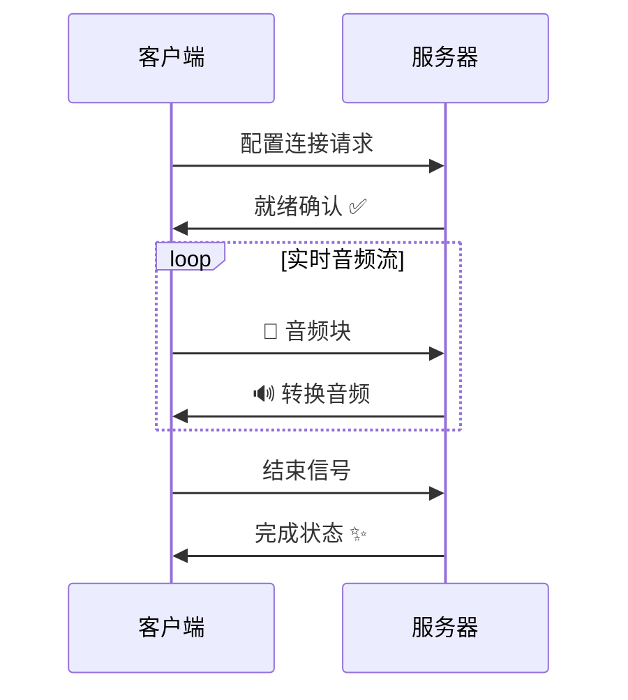

<p align="center">
    
</p>

<div align="center">
  
  
  
</div>

<div align="center">
  <h3>专为云端部署设计的工业级流式换声服务，从Git仓库到私有API平台</h3>
</div> 

<div align="center">
  <a href="README.md">English</a> | 简体中文
</div>
<br>

> 功能持续迭代更新中。欢迎关注我们的最新进展... ✨

# 🚀 快速开始

## 环境配置
```bash
git clone https://github.com/Leroll/fast-vc-service.git
cd fast-vc-service
pip install -r requirements.txt
cp .env.example .env  # 可选：编辑配置参数
```

## 启动服务
```bash
./scripts/start.sh     # 🟢 启动服务
./scripts/shutdown.sh  # 🔴 停止服务
```

# 📡 实时流式换声

## WebSocket 连接流程


**支持格式**: PCM | OPUS

## 🔥 快速测试

### WebSocket 实时换声
```bash
python client/ws_client.py \
    --source-wav-path "input.wav" \
    --encoding OPUS
```

### 批量文件测试, 用于验证换声效果
```bash
python client/file_vc.py \
    --source-wav-path "input1.wav input2.wav" \
    --reference-wav-path "wavs/references/ref.wav" \
    --block-time 0.5 \
    --diffusion-steps 10
```


# 🚧 施工中...TODO
- [ ] tag - v0.1 - 基础服务相关 - v2025-xx
    - [x] 完成初版流式推理代码 
    - [x] 新增.env用于存放源等相关变量
    - [x] 拆分流式推理各模块
    - [x] 新增性能追踪统计模块
    - [x] 增加opus编解码模块
    - [x] 新增asgi app服务和log日志系统，解决uvicorn与loguru的冲突问题
    - [x] 输出ouput转换为16k之后再输出，同时使用切片赋值
    - [x] 新增session类，用于流式推理过程中上下文存储
    - [x] 冗余代码清理，删去不必要的逻辑
    - [x] 完成各模块流水线重构
    - [x] session 部分的替换完善
    - [ ] 添加配置信息
    - [x] 完善log系统
    - [x] 完成ws服务代码 + PCM
    - [x] 完成ws + opus 服务代码
    - [ ] ws_client 增加发送音频samplerate的设置
    - [x] Readme中添加websocket支持的描述，然后画出流程图
    - [ ] 支持webRTC
    - [ ] 裁剪封面图
    - [ ] file_vc，针对最后一个block的问题
    - [ ] 针对 异常情况，比如某个chunk转换rta>1的时候，有没有什么处理方案？
    - [ ] ✨优化requirement包管理方式，更易用与稳定
- [ ] tag - v0.2 - 音频质量相关 -  v2025-xx
    - [ ] infer_wav 每个chunk大小问题排查，在经过vcmodel之后，为8781，不经过的话为9120【sola模块记录】
    - [ ] 声音貌似有些抖动，待排查
    - [ ] 针对男性低沉嗓音转换效果不加的情况，添加流式场景下的音高提取功能
    - [ ] 完成对seed-vc V2.0 模型支持
- [ ] tag - v0.3 - 服务灵活稳定相关 - v2025-xx
    - [ ] reference 使用torchaudio 直接读取到GPU中，省去转移的步骤。
    - [ ] 配置化启动不同的模型实例，配置为不同的微服务？
    - [ ] 制作AutoDL镜像，方便一键部署
    - [ ] 新增get请求返回加密wav
    - [ ] 新增wss支持
    - [ ] 鉴权部分更新为令牌（JWT）方式

# 🙏 致谢
- [Seed-VC](https://github.com/Plachtaa/seed-vc) - 提供了强大的底层变声模型
- [RVC](https://github.com/RVC-Project/Retrieval-based-Voice-Conversion-WebUI) - 提供了基础的流式换声pipeline