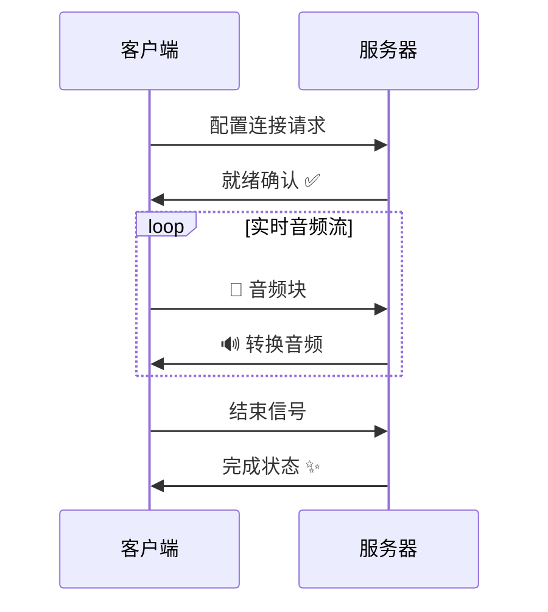

<p align="center">
    
</p>

<div align="center">
  
  <a href="https://github.com/Leroll/fast-vc-service/commits/main">
    
  </a>
  
  
</div>

<div align="center">
  <h3>基于 Seed-VC 的实时语音转换服务，提供 WebSocket 接口，支持 PCM 和 Opus 音频格式</h3>
</div> 

<div align="center">
  <a href="README.md">English</a> | 简体中文
</div>
<br>

> 功能持续迭代更新中。欢迎关注我们的最新进展... ✨

# 📊 性能表现

<div align="center">

| GPU | 并发| Worker | 音频块时长 | 首token延迟 | 端到端延迟 | 平均chunk延迟 | 平均RTF | 中位数RTF | P95 RTF |
|-----|----|--------|----------|-------------|----------|-------------|---------|----------|---------|
|4090D  |1  |6      |500       |136.0        |143.0     |105.0        |0.21     |0.22      |0.24     |
|4090D  |12 |12     |500       |140.1        |256.6     |216.6        |0.44     |0.45      |0.51     |
|1080TI |1  |6      |500       |157.0        |272.0     |252.2        |0.50     |0.51      |0.61     |
|1080TI |3  |6      |500       |154.3        |261.3     |304.9        |0.61     |0.62      |0.73     |

</div>

- 时间单位为: 毫秒(ms)
- 查看详细的测试报告: 
    - [性能测试报告_4090D](docs/perfermance_tests/version0.1.0_4090D.md)
    - [性能测试报告_1080ti](docs/perfermance_tests/version0.1.0_1080ti.md)

# 🚀 快速开始

## 安装

### 方式一：使用 Poetry
```bash
git clone --recursive https://github.com/Leroll/fast-vc-service.git
cd fast-vc-service
cp .env.example .env  # 配置环境变量
poetry install  # 安装依赖
```

### 方式二：使用现有 Conda 环境
```bash
git clone --recursive https://github.com/Leroll/fast-vc-service.git
cd fast-vc-service
cp .env.example .env  # 配置环境变量

# 激活现有的conda环境（Python 3.10+）
conda activate your_env_name

# 使用 Poetry（禁用虚拟环境）
poetry config virtualenvs.create false
poetry install
```

当第一次运行时，模型会自动下载到checkpoint文件夹下。  
如果有网络问题，可取消注 `.env` 文件中的 `HF_ENDPOINT` 变量，使用国内镜像源加速模型下载。


### 替换poetry源（如果有需要）
```
poetry source remove aliyun
poetry source add new_name https://xx/pypi/simple --priority=primary
rm poetry.lock  # 删除锁文件，重新生成
poetry lock 
poetry install  
```


## 启动服务
```bash
# 启动服务
fast-vc serve  # 默认启动使用 .env 中的 env_profile
fast-vc serve --env prod  # 指定环境配置
nohup fast-vc serve > /dev/null 2>&1 &  # 后台运行服务

# 使用 Poetry
poetry run fast-vc serve
```

<!-- 添加服务启动演示 -->
<p align="center">
    
    <br>
    <em>🚀 服务启动过程</em>
</p>

## 服务管理
```bash
# 查看服务状态
fast-vc status

# 停止服务（优雅关闭）
fast-vc stop
fast-vc stop --force   # 强制

# 清理日志文件
fast-vc clean
fast-vc clean -y  # 跳过确认

# 查看版本信息
fast-vc version
```

### 服务管理说明
- `serve`: 启动 FastAPI 服务器
- `status`: 检查服务运行状态和进程信息
- `stop`: 优雅关闭服务（发送 SIGINT 信号）
- `stop --force`: 强制关闭服务（发送 SIGTERM 信号）
- `clean`: 清理 logs/ 目录下的日志文件
- `clean -y`: 清理日志文件，跳过确认提示
- `version`: 显示服务版本信息

服务信息会自动保存到项目的 `temp/` 目录下，支持进程状态检查和自动清理。


<p align="center">
    
    <br>
    <em>🚀 命令演示</em>
</p>

# 📡 实时流式语音转换

## WebSocket 连接流程


**详细的WebSocket API规范请参考**: [WebSocket API规范](docs/api_docs/websocket-api-doc.md)  
**支持格式**: PCM | OPUS  

## 🔥 快速测试

### WebSocket 实时语音转换
```bash
python examples/websocket/ws_client.py \
    --source-wav-path "wavs/sources/low-pitched-male-24k.wav" \
    --encoding OPUS
```

### 批量文件测试, 用于验证语音转换效果, 不需要启动服务
```bash
python examples/file_conversion/file_vc.py \
    --source-wav-path "wavs/sources/low-pitched-male-24k.wav" \
```

## 🚀 并发性能测试

### 多客户端并发测试
使用并发WebSocket客户端测试服务器的处理能力：

```bash
# 启动5个并发客户端，无延迟同时开始
python examples/websocket/concurrent_ws_client.py \
    --num-clients 5 \
    --source-wav-path "wavs/sources/low-pitched-male-24k.wav" \
    --encoding OPUS

# 启动10个客户端，每隔2秒启动一个
python examples/websocket/concurrent_ws_client.py \
    --num-clients 10 \
    --delay-between-starts 2.0 \
    --max-workers 4 \
    --timeout 600

# 测试不同音频格式
python examples/websocket/concurrent_ws_client.py \
    --num-clients 3 \
    --encoding PCM \
    --chunk-time 40 \
    --real-time
```

### 测试参数说明
- `--num-clients`: 并发客户端数量（默认：5）
- `--delay-between-starts`: 客户端启动间隔秒数（默认：0.0，同时启动）
- `--max-workers`: 最大工作进程数（默认：min(8, num_clients)）
- `--timeout`: 单个客户端超时时间（默认：420秒）
- `--chunk-time`: 音频分块时间，毫秒（默认：20ms）
- `--encoding`: 音频编码格式，PCM或OPUS（默认：PCM）
- `--real-time`: 启用实时音频发送模拟
- `--no-real-time`: 禁用实时模拟，尽可能快地发送

### 性能指标分析

测试完成后会自动生成详细的性能分析报告，包括：

#### 🕐 延迟指标
- **首包延迟 (First Token Latency)**: 第一个音频包的处理延迟
- **端到端延迟 (End-to-End Latency)**: 完整音频流的处理延迟
- **分块延迟统计**: 每个音频块的延迟分布（均值、中位数、P95、P99等）
- **延迟抖动 (Jitter)**: 延迟的标准差，衡量延迟稳定性

#### ⚡ 实时性指标
- **实时因子 (RTF)**: 处理时间/音频时长的比值
  - RTF < 1.0: 满足实时处理要求
  - RTF > 1.0: 处理速度跟不上音频播放速度
- **RTF统计**: 包含均值、中位数、P95、P99等分布信息

#### 📊 发送时序分析
- **发送延迟统计**: 实际发送间隔 vs 期望音频间隔
- **时序质量评估**: 发送稳定性和连续延迟检测

#### 📈 示例输出
```json
{
  "first_token_latency_ms": 285.3,
  "end_to_end_latency_ms": 1247.8,
  "chunk_latency_stats": {
    "mean_ms": 312.5,
    "median_ms": 298.1,
    "p95_ms": 456.7,
    "p99_ms": 523.2
  },
  "real_time_factor": {
    "mean": 0.87,
    "median": 0.85,
    "p95": 1.12
  },
  "is_real_time": true,
  "timeline_summary": {
    "total_send_events": 156,
    "total_recv_events": 148,
    "send_duration_ms": 3120,
    "processing_start_to_end_ms": 3368
  }
}
```

### 结果文件说明
测试完成后会在 `outputs/concurrent_ws_client/` 目录下生成：
- `clientX_result.json`: 每个客户端的完整结果数据
- `clientX_stats.json`: 每个客户端的性能统计分析
- `clientX_output.wav`: 转换后的音频文件（如果启用保存）


# 📦 版本更新
<!-- don't forget to change version in __init__ and toml -->

**v0.1.1 - v2025-06-19**: 新增换声性能优化   

  - 新增查询性能监控接口 /tools/performance-report，支持查询实时性能指标
  - 细化耗时日志，便于分析性能瓶颈
  - 缓解人声首包调用模型导致的延迟问题

**v0.1.0 - v2025-06-15**: 基础服务框架   

  完成了基于 Seed-VC 的实时语音转换服务的核心框架搭建，实现了 WebSocket 流式推理、性能监控、多格式音频支持等完整的基础功能。   

  - 实时流式语音转换服务
  - WebSocket API 支持 PCM 和 Opus 格式
  - 完整的性能监控和统计系统
  - 灵活的配置管理和环境变量支持 
  - 多Worker并发处理能力
  - 并发性能测试框架


# 🚧 施工中...TODO
- [ ] tag - v0.1.2 - 添加流式场景下，音高自适应提取功能 -  v2025-06-26
    - [ ] 增加音高自适应提取功能，并添加对应开关
    - [ ] 完成对seed-vc V2.0 模型支持
- [ ] tag - v0.2 - 提升推理时效，降低RTF - v2025-xx
    - [ ] 探索降低模型推理时延的方案（比如新的模型架构、量化等）
    - [ ] reference 使用torchaudio 直接读取到GPU中，省去转移的步骤。
    - [ ] file_vc，针对最后一个block的问题
    - [ ] 制作镜像，方便部署
    - [ ] 制作AutoDL镜像

# 🙏 致谢
- [Seed-VC](https://github.com/Plachtaa/seed-vc) - 提供了强大的底层变声模型
- [RVC](https://github.com/RVC-Project/Retrieval-based-Voice-Conversion-WebUI) - 提供了基础的流式语音转换pipeline