<p align="center">
    
</p>

<div align="center">
  
  <a href="https://github.com/Leroll/fast-vc-service/commits/main">
    
  </a>
  
  
</div>

<div align="center">
  <h3>基于 Seed-VC 的实时换声服务，提供 WebSocket 接口，支持 PCM 和 Opus 音频格式</h3>
</div> 

<div align="center">
  <a href="README.md">English</a> | 简体中文
</div>
<br>

> 功能持续迭代更新中。欢迎关注我们的最新进展... ✨

# 🚀 快速开始

## 安装

### 方式一：使用 Poetry
```bash
git clone --recursive https://github.com/Leroll/fast-vc-service.git
cd fast-vc-service
cp .env.example .env  # 配置环境变量
poetry install  # 安装依赖
```

### 方式二：使用现有 Conda 环境
```bash
git clone --recursive https://github.com/Leroll/fast-vc-service.git
cd fast-vc-service
cp .env.example .env  # 配置环境变量

# 激活现有的conda环境（Python 3.10+）
conda activate your_env_name

# 使用 Poetry（禁用虚拟环境）
poetry config virtualenvs.create false
poetry install
```

当第一次运行时，模型会自动下载到checkpoint文件夹下。  
如果有网络问题，可取消注 `.env` 文件中的 `HF_ENDPOINT` 变量，使用国内镜像源加速模型下载。


### 替换poetry源（如果有需要）
```
poetry source remove aliyun
poetry source add new_name https://xx/pypi/simple --priority=primary
rm poetry.lock  # 删除锁文件，重新生成
poetry lock 
poetry install  
```


## 启动服务
```bash
# 启动服务
fast-vc serve  # 默认启动使用 .env 中的 env_profile
fast-vc serve --env prod  # 指定环境配置

# 使用 Poetry
poetry run fast-vc serve
```

<!-- 添加服务启动演示 -->
<p align="center">
    
    <br>
    <em>🚀 服务启动过程</em>
</p>

## 服务管理
```bash
# 查看服务状态
fast-vc status

# 停止服务（优雅关闭）
fast-vc stop
fast-vc stop --force   # 强制

# 清理日志文件
fast-vc clean
fast-vc clean -y  # 跳过确认

# 查看版本信息
fast-vc version
```

### 服务管理说明
- `serve`: 启动 FastAPI 服务器
- `status`: 检查服务运行状态和进程信息
- `stop`: 优雅关闭服务（发送 SIGINT 信号）
- `stop --force`: 强制关闭服务（发送 SIGTERM 信号）
- `clean`: 清理 logs/ 目录下的日志文件
- `clean -y`: 清理日志文件，跳过确认提示
- `version`: 显示服务版本信息

服务信息会自动保存到项目的 `temp/` 目录下，支持进程状态检查和自动清理。


<p align="center">
    
    <br>
    <em>🚀 命令演示</em>
</p>

# 📡 实时流式换声

## WebSocket 连接流程

```mermaid
sequenceDiagram
    participant C as 客户端
    participant S as 服务器
    
    C->>S: 配置连接请求
    S->>C: 就绪确认 ✅
    
    loop 实时音频流
        C->>S: 🎤 音频块
        S->>C: 🔊 转换音频
    end
    
    C->>S: 结束信号
    S->>C: 完成状态 ✨
```


**详细的WebSocket API规范请参考**: [WebSocket API规范](docs/api_docs/websocket-api-doc.md)  
**支持格式**: PCM | OPUS  

## 🔥 快速测试

### WebSocket 实时换声
```bash
python examples/websocket/ws_client.py \
    --source-wav-path "wavs/sources/low-pitched-male-24k.wav" \
    --encoding OPUS
```

### 批量文件测试, 用于验证换声效果, 不需要启动服务
```bash
python examples/file_vc.py \
    --source-wav-path "wavs/sources/low-pitched-male-24k.wav" \
```

## 🚀 并发性能测试

### 多客户端并发测试
使用并发WebSocket客户端测试服务器的处理能力：

```bash
# 启动5个并发客户端，无延迟同时开始
python examples/websocket/concurrent_ws_client.py \
    --num-clients 5 \
    --source-wav-path "wavs/sources/low-pitched-male-24k.wav" \
    --encoding OPUS

# 启动10个客户端，每隔2秒启动一个
python examples/websocket/concurrent_ws_client.py \
    --num-clients 10 \
    --delay-between-starts 2.0 \
    --max-workers 4 \
    --timeout 600

# 测试不同音频格式
python examples/websocket/concurrent_ws_client.py \
    --num-clients 3 \
    --encoding PCM \
    --chunk-time 40 \
    --real-time
```

### 测试参数说明
- `--num-clients`: 并发客户端数量（默认：5）
- `--delay-between-starts`: 客户端启动间隔秒数（默认：0.0，同时启动）
- `--max-workers`: 最大工作进程数（默认：min(8, num_clients)）
- `--timeout`: 单个客户端超时时间（默认：420秒）
- `--chunk-time`: 音频分块时间，毫秒（默认：20ms）
- `--encoding`: 音频编码格式，PCM或OPUS（默认：PCM）
- `--real-time`: 启用实时音频发送模拟
- `--no-real-time`: 禁用实时模拟，尽可能快地发送

### 性能指标分析

测试完成后会自动生成详细的性能分析报告，包括：

#### 🕐 延迟指标
- **首包延迟 (First Token Latency)**: 第一个音频包的处理延迟
- **端到端延迟 (End-to-End Latency)**: 完整音频流的处理延迟
- **分块延迟统计**: 每个音频块的延迟分布（均值、中位数、P95、P99等）
- **延迟抖动 (Jitter)**: 延迟的标准差，衡量延迟稳定性

#### ⚡ 实时性指标
- **实时因子 (RTF)**: 处理时间/音频时长的比值
  - RTF < 1.0: 满足实时处理要求
  - RTF > 1.0: 处理速度跟不上音频播放速度
- **RTF统计**: 包含均值、中位数、P95、P99等分布信息

#### 📊 发送时序分析
- **发送延迟统计**: 实际发送间隔 vs 期望音频间隔
- **时序质量评估**: 发送稳定性和连续延迟检测

#### 📈 示例输出
```json
{
  "first_token_latency_ms": 285.3,
  "end_to_end_latency_ms": 1247.8,
  "chunk_latency_stats": {
    "mean_ms": 312.5,
    "median_ms": 298.1,
    "p95_ms": 456.7,
    "p99_ms": 523.2
  },
  "real_time_factor": {
    "mean": 0.87,
    "median": 0.85,
    "p95": 1.12
  },
  "is_real_time": true,
  "timeline_summary": {
    "total_send_events": 156,
    "total_recv_events": 148,
    "send_duration_ms": 3120,
    "processing_start_to_end_ms": 3368
  }
}
```

### 结果文件说明
测试完成后会在 `outputs/concurrent_ws_client/` 目录下生成：
- `clientX_result.json`: 每个客户端的完整结果数据
- `clientX_stats.json`: 每个客户端的性能统计分析
- `clientX_output.wav`: 转换后的音频文件（如果启用保存）

# 🚧 施工中...TODO
- [ ] tag - v0.1 - 基础服务相关 - v2025-xx
    - [x] 完成初版流式推理代码 
    - [x] 新增.env用于存放源等相关变量
    - [x] 拆分流式推理各模块
    - [x] 新增性能追踪统计模块
    - [x] 增加opus编解码模块
    - [x] 新增asgi app服务和log日志系统，解决uvicorn与loguru的冲突问题
    - [x] 输出ouput转换为16k之后再输出，同时使用切片赋值
    - [x] 新增session类，用于流式推理过程中上下文存储
    - [x] 冗余代码清理，删去不必要的逻辑
    - [x] 完成各模块流水线重构
    - [x] session 部分的替换完善
    - [x] 完善log系统
    - [x] 完成ws服务代码 + PCM
    - [x] 完成ws + opus 服务代码
    - [x] Readme中添加websocket支持的描述，然后画出流程图
    - [x] 优化requirement包管理方式，更易用与稳定
    - [x] 新增clean命令，用于清理日志文件
    - [x] 新增多worker支持
    - [x] 抽取ws-server中音频处理逻辑至独立函数中
    - [x] 抽取ws-server中结尾残留音频处理逻辑至独立函数中
    - [x] 新增ws超时关闭链接机制，触发回收
    - [x] 添加配置信息
    - [x] 增加性能测试模块
    - [x] 在session中增加，单通录音的各种耗时统计
    - [x] 解决 ws_client 收到的音频缺少尾部片段的问题
    - [x] 音频按天存储
    - [x] 新增websocket消息名灵活配置功能，可通过配置文件修改 
    - [x] ws_client 增加发送音频samplerate的设置
    - [ ] 增加websocket接口，基于id调取压编码以及加密后的音频以及统计文件
    - [ ] 制作镜像，方便部署
    - [ ] 针对 异常情况，比如某个chunk转换rta>1的时候，有没有什么处理方案？
    - [ ] 解决 semaphore leak 的问题
    - [ ] 新增基于负责情况动态适配difusion steps 的功能，以保证实时性
    - [ ] 制作AutoDL镜像
- [ ] tag - v0.2 - 音频质量相关 -  v2025-xx
    - [ ] infer_wav 每个chunk大小问题排查，在经过vcmodel之后，为8781，不经过的话为9120【sola模块记录】
    - [ ] 声音貌似有些抖动，待排查
    - [ ] 针对男性低沉嗓音转换效果不加的情况，添加流式场景下的音高提取功能
    - [ ] 完成对seed-vc V2.0 模型支持
- [ ] tag - v0.3 - 服务灵活稳定相关 - v2025-xx
    - [ ] reference 使用torchaudio 直接读取到GPU中，省去转移的步骤。
    - [ ] 配置化启动不同的模型实例，配置为不同的微服务？
    - [ ] 新增get请求返回加密wav
    - [ ] 新增wss支持
    - [ ] 鉴权部分更新为令牌（JWT）方式
    - [ ] 支持webRTC
    - [ ] file_vc，针对最后一个block的问题

# 🙏 致谢
- [Seed-VC](https://github.com/Plachtaa/seed-vc) - 提供了强大的底层变声模型
- [RVC](https://github.com/RVC-Project/Retrieval-based-Voice-Conversion-WebUI) - 提供了基础的流式换声pipeline